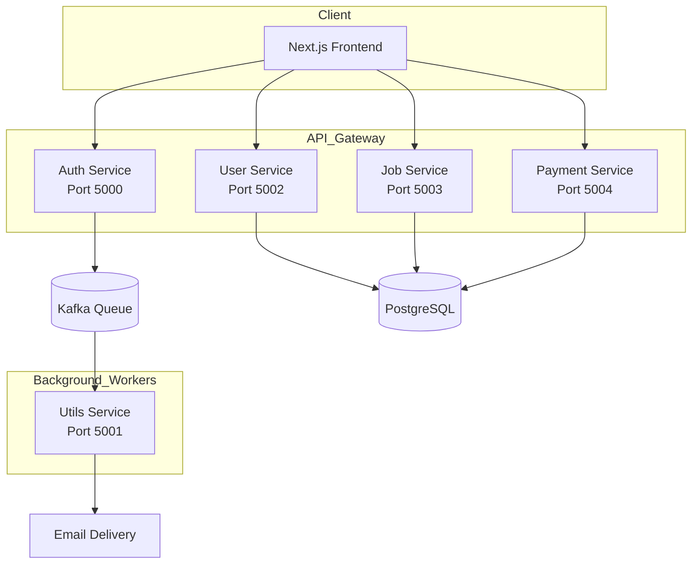

# job portal 🚀

A modern, high-performance Job Portal application built with a scalable **Microservices Architecture**. It features premium UI/UX, AI-powered resume analysis, and integrated payment systems.

## 🌟 Key Features

- **AI-Powered Carrer Guidence**: AI-driven career guidance with detailed analysis and suggestions.
- **AI Resume Analyzer**: AI-driven ATS compatibility checking with detailed score breakdown and suggestions.
- **Premium Subscriptions**: Razorpay integration for unlocking exclusive features like priority job applications.
- **Microservices Orchestration**: Distributed system handling Auth, User Management, Job Listings, and Utilities.
- **Event-Driven Messaging**: Kafka-powered email delivery system for seamless notifications.
- **Glassmorphism UI**: Beautiful, dark-themed responsive design matching modern aesthetic standards.

## 🛠️ Tech Stack

### Frontend

- **Framework**: [Next.js](https://nextjs.org/) (App Router)
- **Styling**: [Tailwind CSS v4](https://tailwindcss.com/)
- **Icons**: [Lucide React](https://lucide.dev/)
- **Components**: [Shadcn UI](https://ui.shadcn.com/)
- **State Management**: React Context API
- **Client Side Utilities**: Axios, Cookies (js-cookie), React Hot Toast

### Backend (Microservices)

- **Runtime**: [Node.js](https://nodejs.org/)
- **Framework**: [Express.js](https://expressjs.com/)
- **Language**: [TypeScript](https://www.typescriptlang.org/)
- **Database**: [PostgreSQL](https://www.postgresql.org/)
- **Messaging**: [Apache Kafka](https://kafka.apache.org/) (Kafkajs)
- **Payments**: [Razorpay SDK](https://razorpay.com/docs/payments/server-integration/nodejs/)
- **Emailing**: [Nodemailer](https://nodemailer.com/)

## 🏗️ System Architecture



## 🔄 Service Overview

- **Auth Service**: Handles user registration, login (JWT), and password resets. Triggers email events via Kafka.
- **User Service**: Manages user profiles, skills, and resume ATS analysis.
- **Job Service**: Core logic for job postings, search, filtering, and the application lifecycle.
- **Payment Service**: Integrates Razorpay for subscription orders and payment verification.
- **Utils Service**: A dedicated consumer service that handles background tasks like sending emails derived from Kafka events.

## 🚀 Getting Started

### Prerequisites

- Node.js (v18+)
- PostgreSQL
- Apache Kafka (running)
- Razorpay Account (for keys)

### Installation

1. **Clone the repository**:

   ```bash
   git clone https://github.com/yourusername/job-portal.git
   cd job-portal
   ```

2. **Frontend Setup**:

   ```bash
   cd frontend
   npm install
   cp .env.example .env.local  # Add your NEXT_PUBLIC_ variables
   npm run dev
   ```

3. **Services Setup**:
   For each service (`auth`, `user`, `job`, `payment`, `utils`):
   ```bash
   cd services/[service-name]
   npm install
   cp .env.example .env  # Configure DB and Kafka URLs
   npm run dev
   ```

## 🔑 Environment Variables

Each microservice and the frontend requires a `.env` file. Key variables include:

- `JWT_SECRET`: Secret for token signing.
- `KAFKA_BROKER`: Address of your Kafka broker.
- `RAZORPAY_KEY_ID` & `RAZORPAY_KEY_SECRET`: Razorpay credentials.
- `DATABASE_URL`: PostgreSQL connection string.

## 📄 License

Distributed under the MIT License. See `LICENSE` for more information.

---

Built with ❤️ by Nikhil ([https://www.linkedin.com/in/nikhilmv8094/])
